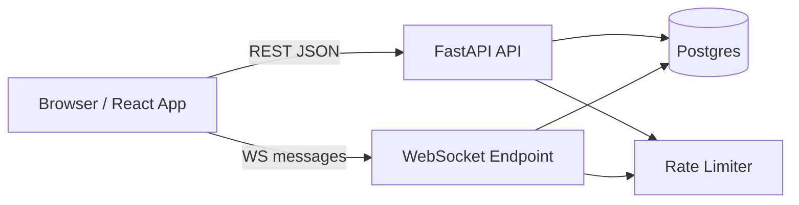
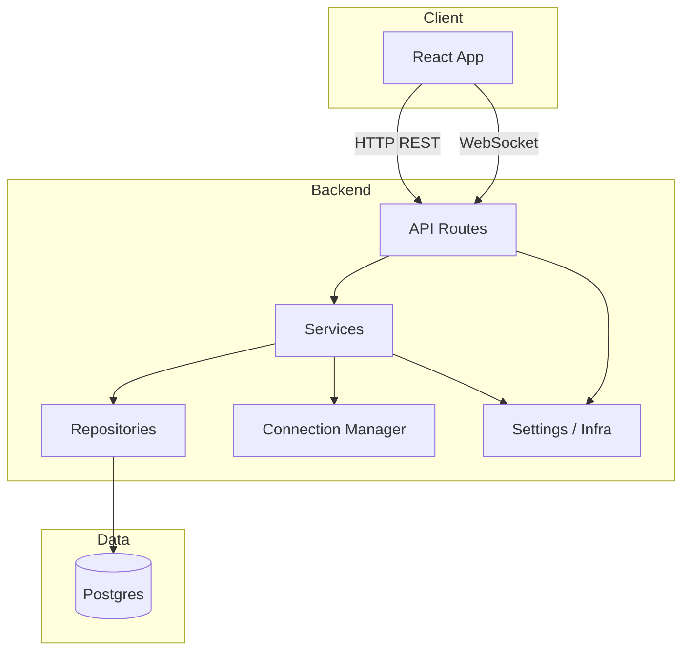
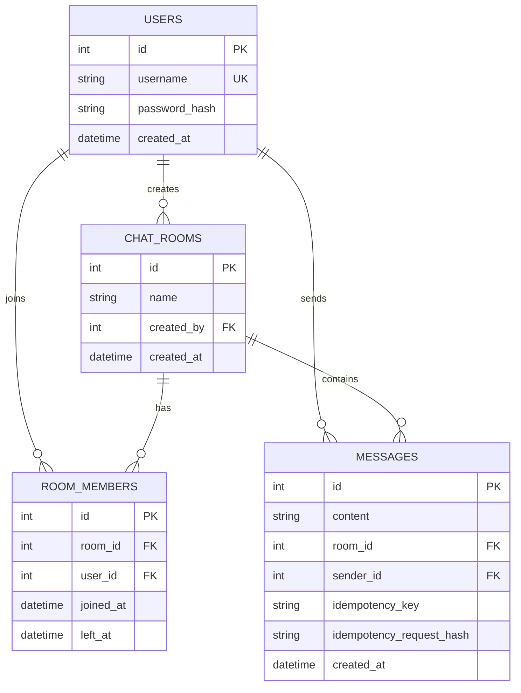
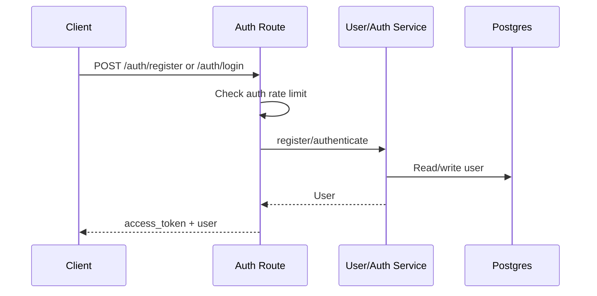
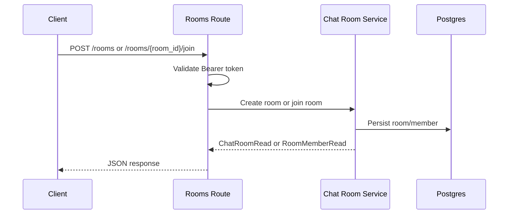
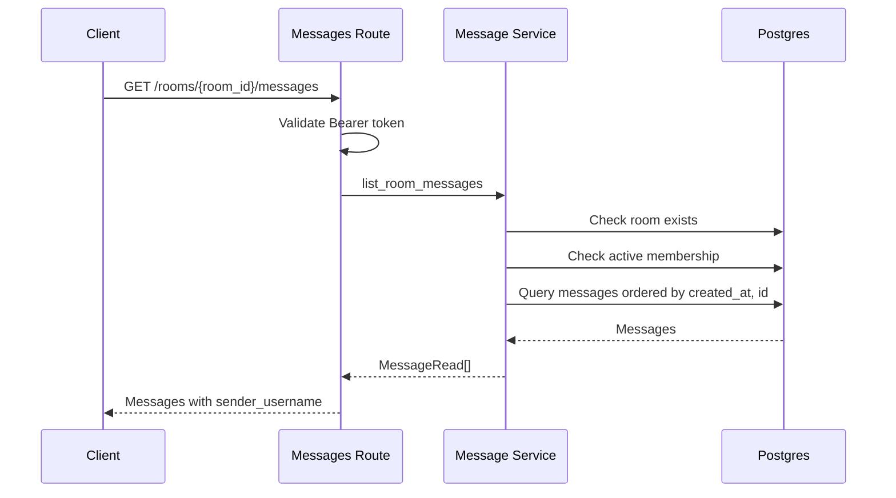
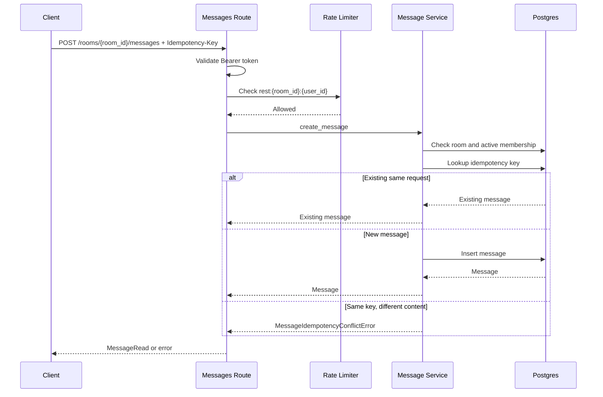
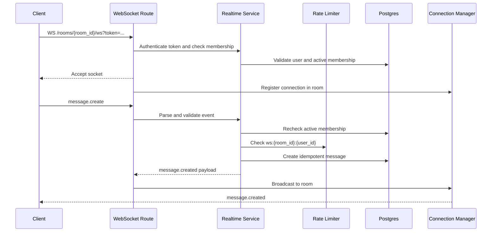
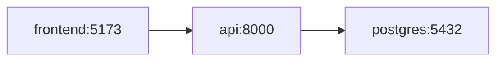

# System Design

Este documento describe el diseno de sistema de GBH Chat: componentes, datos, flujos, decisiones tecnicas, limites actuales y caminos de evolucion.

## Objetivo Del Sistema

GBH Chat permite que usuarios autenticados creen salas, se unan a salas, consulten historial y envien mensajes en tiempo real.

Requisitos funcionales cubiertos:

- Registro y login con JWT.
- CRUD basico de usuarios y salas.
- Membresia de salas con join/leave.
- Historial de mensajes por sala.
- Envio de mensajes por REST con idempotencia.
- Envio y broadcast de mensajes por WebSocket.
- Rate limiting para auth y mensajes.
- Health checks para liveness y readiness.

Requisitos no funcionales cubiertos:

- Separacion de capas.
- Migraciones versionadas.
- Tests automatizados backend.
- Configuracion por entorno.
- Contratos documentados para REST y WebSocket.

## Vista De Alto Nivel



Componentes:

- Frontend React/Vite: interfaz de usuario, auth client-side, REST client y WebSocket client.
- FastAPI REST: auth, usuarios, salas, membresia, historial y envio REST de mensajes.
- FastAPI WebSocket: conexion realtime por sala y broadcast de mensajes.
- Postgres: fuente de verdad para usuarios, salas, membresias y mensajes.
- Rate limiter: proteccion contra abuso, usando `limits`.

## Contenedores



La API mantiene una arquitectura por capas:

```text
routes -> services -> repositories -> models
```

El frontend sigue una separacion similar:

```text
pages -> hooks -> api
pages -> components
```

Referencias:

- [folder-architecture.md](folder-architecture.md)
- [design-patterns.md](design-patterns.md)

## Modelo De Datos



Notas:

- `users.username` es unico.
- `messages.content` tiene maximo de 1000 caracteres.
- `messages` tiene constraint unico en `room_id + sender_id + idempotency_key`.
- `room_members.left_at = null` representa membresia activa.
- Eliminar una sala elimina sus mensajes y membresias por cascade ORM.

## Flujos Principales

### Registro Y Login



Decisiones:

- Passwords se reciben en texto plano solo en request HTTPS esperado.
- La API almacena `password_hash`, nunca password plano.
- JWT usa `sub` como `user_id`.
- En produccion, `JWT_SECRET_KEY` debe cambiarse.

### Crear O Unirse A Sala



Decisiones:

- Crear una sala asigna `created_by` al usuario autenticado.
- Join crea o reactiva membresia segun el estado previo.
- Leave marca `left_at`; no borra el historial de membresia.

### Cargar Historial



Decisiones:

- Solo miembros activos pueden leer historial.
- El orden es ascendente por `created_at` y `id`.
- `sender_username` se incluye para evitar lookups extra en frontend.

### Enviar Mensaje Por REST



Decisiones:

- `Idempotency-Key` es obligatoria en REST.
- El hash de idempotencia lo calcula el backend.
- Reusar key con otro contenido devuelve `409 Conflict`.
- El rate limit actual ocurre antes del lookup idempotente.

Referencia: [idempotency.md](idempotency.md).

### Enviar Mensaje Por WebSocket



Decisiones:

- Token via query string por limitaciones del navegador con WebSocket headers.
- La membresia se valida al conectar y antes de cada mensaje.
- El cliente manda `client_message_id`; el backend deriva `sender_id` del JWT.
- Broadcast se limita al `room_id`.
- Si la sala se elimina, conexiones activas de esa sala se cierran.

Referencia: [websocket.md](websocket.md).

## Seguridad

Controles actuales:

- JWT bearer para rutas protegidas.
- `get_current_user` centraliza validacion de token.
- Password hashing antes de persistir usuarios.
- `JWT_SECRET_KEY` obligatorio distinto del default en produccion.
- CORS configurable por entorno.
- Validacion de membresia activa para leer/enviar mensajes.
- El cliente no puede definir `sender_id`.
- Rate limiting en registro, login y envio de mensajes.
- Idempotencia para evitar duplicados en retries.
- Logging de fallos relevantes sin exponer secretos.

Riesgos/pendientes para produccion:

- Usar HTTPS obligatorio delante de API y frontend.
- Usar un secreto JWT fuerte y rotacion planificada.
- Usar Redis para rate limiting en despliegues multi-instancia.
- Revisar politicas de expiracion/revocacion de tokens.
- Agregar observabilidad centralizada de logs y metricas.

## Escalabilidad Y Disponibilidad

Estado actual:

- API stateless para REST.
- WebSocket mantiene estado en memoria por proceso.
- Rate limiting usa `memory://` por defecto.
- Postgres es la fuente de verdad.

Implicaciones:

- Escalar REST horizontalmente es directo si todos los procesos comparten la misma DB.
- Escalar WebSocket requiere sticky sessions o un pub/sub compartido para broadcast cross-instance.
- Con `memory://`, cada instancia aplica rate limit de forma independiente.
- Para produccion multi-instancia, usar Redis para rate limit y posiblemente pub/sub realtime.

Evolucion recomendada:

```text
Single instance
  -> API replicas behind load balancer
  -> Redis for rate limit
  -> Redis pub/sub or message broker for WebSocket broadcast
  -> Metrics/tracing/log aggregation
```

## Consistencia Y Concurrencia

Mensajes:

- Persistencia ocurre antes del broadcast.
- El mensaje emitido por WebSocket ya existe en DB.
- Idempotencia protege retries REST y WebSocket.
- Constraint unico en DB protege carreras concurrentes con la misma key.

Membresia:

- Se revalida en cada `message.create`.
- Un usuario que hizo `leave` deja de poder leer/enviar.
- Sockets abiertos pierden acceso en el siguiente envio y reciben cierre `1008`.

## Observabilidad

Actual:

- Logs estructurados para auth fallida, conflictos de idempotencia, errores WebSocket y health DB.
- `/health` para liveness sin DB.
- `/health/db` para readiness con `SELECT 1`.

Recomendado:

- Correlation/request IDs.
- Metricas de latencia por endpoint.
- Contadores de `message.created`, errores WebSocket y rate limits.
- Dashboard de conexiones WebSocket activas por sala/instancia.

## Deployment Local

Docker Compose levanta:

- `postgres`: Postgres 17.
- `api`: FastAPI, Alembic upgrade y Uvicorn.
- `frontend`: Vite dev server.



El contenedor API espera el health check de Postgres antes de iniciar.

## Tradeoffs Actuales

- Offset pagination es simple, pero cursor pagination seria mejor para historial grande.
- WebSocket in-memory es suficiente para una instancia, pero no para broadcast multi-instancia.
- Rate limit in-memory es comodo en desarrollo, pero Redis es necesario si hay replicas.
- No hay UI optimista para mensajes; reduce duplicados, pero puede sentirse menos instantaneo.
- REST y WebSocket usan contadores de rate limit separados para el mismo usuario/sala.
- No hay busqueda de mensajes ni read receipts.

## Referencias

- [folder-architecture.md](folder-architecture.md)
- [design-patterns.md](design-patterns.md)
- [websocket.md](websocket.md)
- [idempotency.md](idempotency.md)
- [rate-limiting.md](rate-limiting.md)
