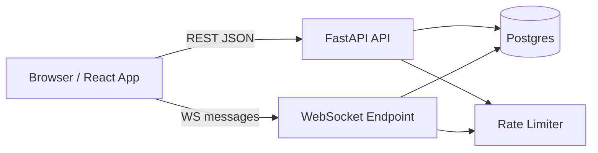
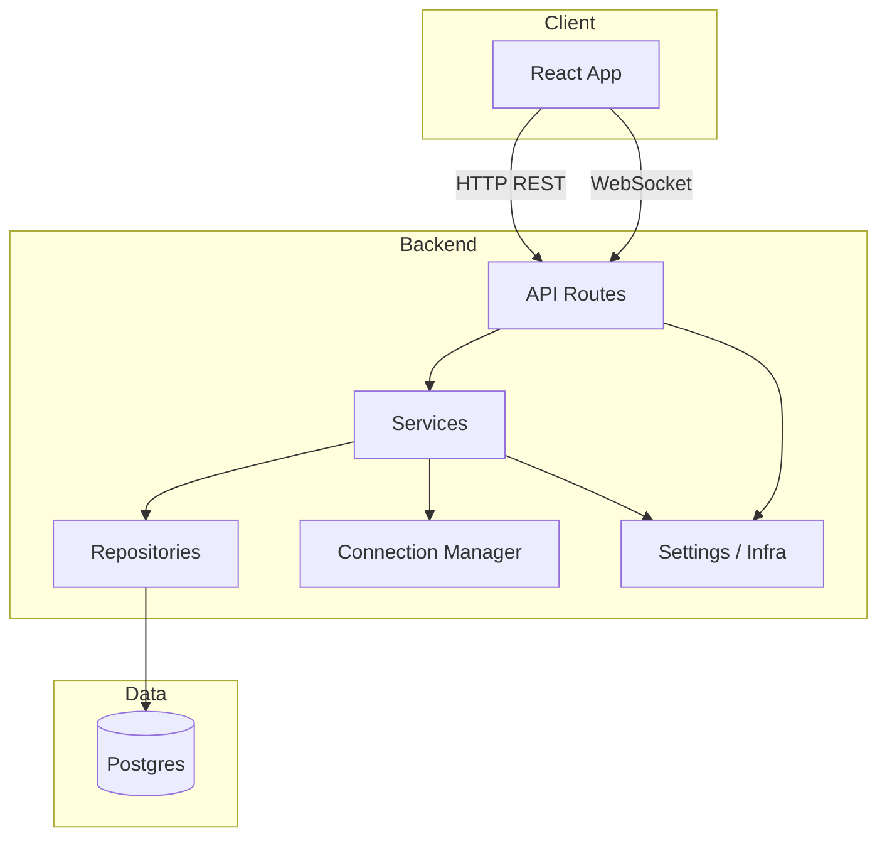
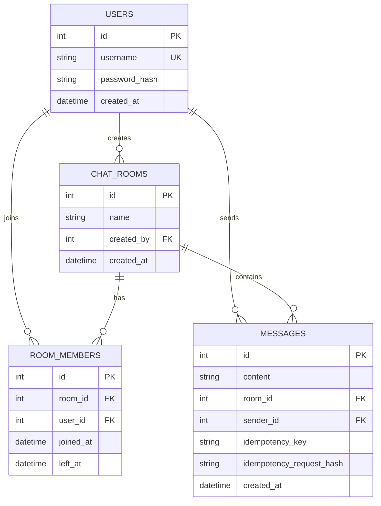
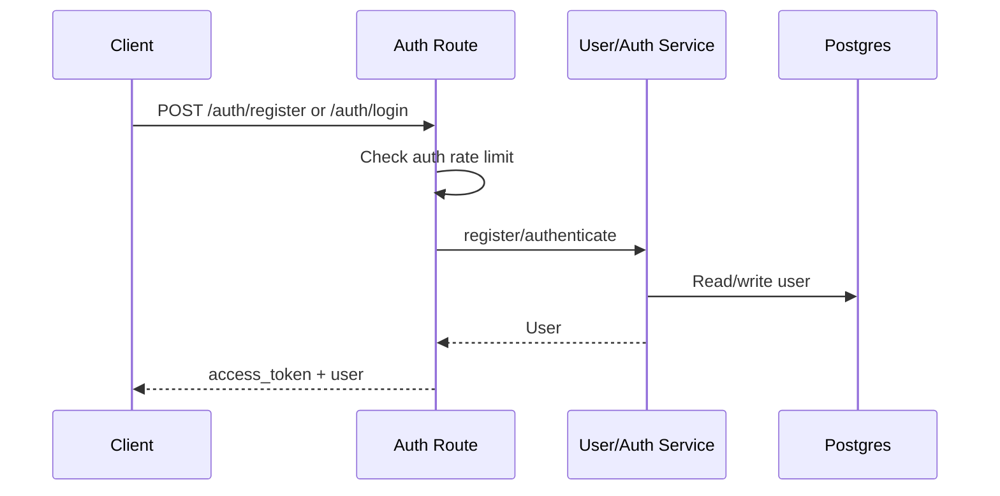
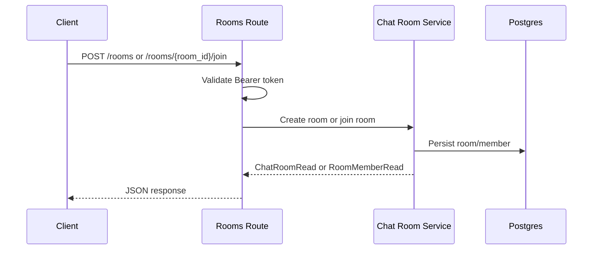
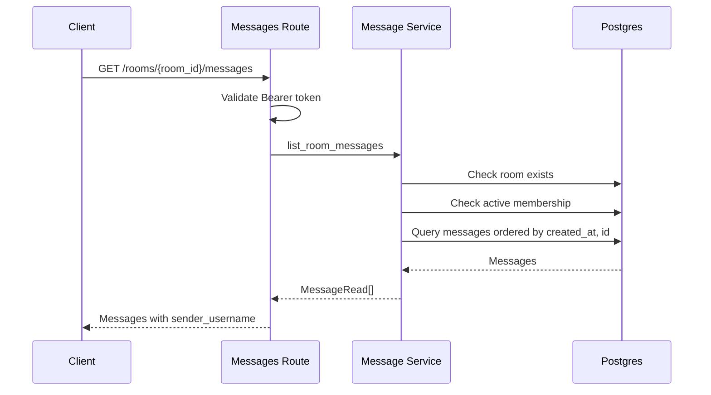
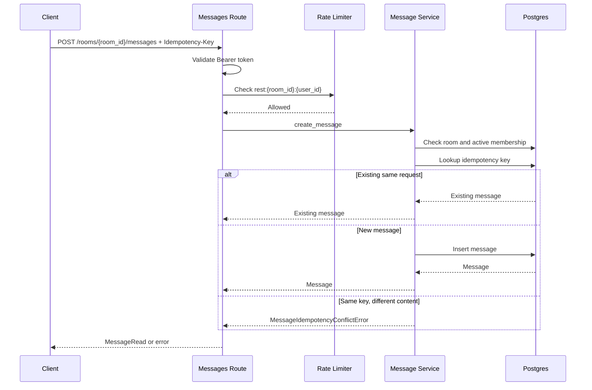
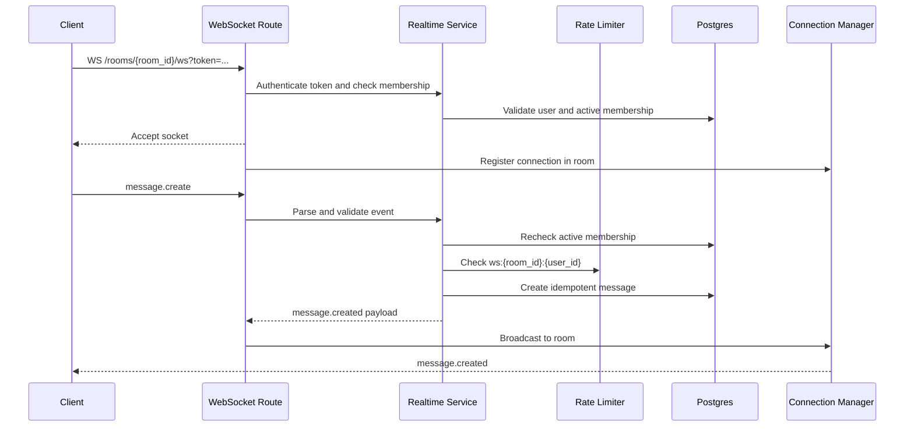
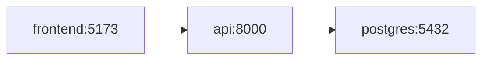

# System Design

This document describes the GBH Chat system design: components, data, flows, technical decisions, current limits, and evolution paths.

## System Goal

GBH Chat allows authenticated users to create rooms, join rooms, read history, and send realtime messages.

Covered functional requirements:

- Registration and login with JWT.
- Basic CRUD for users and rooms.
- Room membership with join/leave.
- Message history per room.
- Message sending over REST with idempotency.
- Message sending and broadcast over WebSocket.
- Rate limiting for auth and messages.
- Health checks for liveness and readiness.

Covered non-functional requirements:

- Layer separation.
- Versioned migrations.
- Automated backend tests.
- Environment-based configuration.
- Documented REST and WebSocket contracts.

## High-Level View



Components:

- React/Vite frontend: user interface, client-side auth, REST client, and WebSocket client.
- FastAPI REST: auth, users, rooms, membership, history, and REST message sending.
- FastAPI WebSocket: realtime room connection and message broadcast.
- Postgres: source of truth for users, rooms, memberships, and messages.
- Rate limiter: abuse protection through `limits`.

## Containers



The API keeps a layered architecture:

```text
routes -> services -> repositories -> models
```

The frontend follows a similar separation:

```text
pages -> hooks -> api
pages -> components
```

References:

- [folder-architecture.md](folder-architecture.md)
- [design-patterns.md](design-patterns.md)

## Data Model



Notes:

- `users.username` is unique.
- `messages.content` has a maximum of 1000 characters.
- `messages` has a unique constraint on `room_id + sender_id + idempotency_key`.
- `room_members.left_at = null` represents active membership.
- Deleting a room deletes its messages and memberships through ORM cascade.

## Main Flows

### Registration And Login



Decisions:

- Passwords are received as plaintext only in the expected HTTPS request.
- The API stores `password_hash`, never plaintext passwords.
- JWT uses `sub` as `user_id`.
- In production, `JWT_SECRET_KEY` must be changed.

### Create Or Join Room



Decisions:

- Creating a room assigns `created_by` to the authenticated user.
- Join creates or reactivates membership depending on prior state.
- Leave sets `left_at`; it does not delete membership history.

### Load History



Decisions:

- Only active members can read history.
- Ordering is ascending by `created_at` and `id`.
- `sender_username` is included to avoid extra frontend lookups.

### Send Message Over REST



Decisions:

- `Idempotency-Key` is required for REST.
- The backend calculates the idempotency hash.
- Reusing a key with different content returns `409 Conflict`.
- The current rate limit check happens before the idempotent lookup.

Reference: [idempotency.md](idempotency.md).

### Send Message Over WebSocket



Decisions:

- Token is passed through the query string because browser WebSocket headers are limited.
- Membership is validated on connect and before every message.
- The client sends `client_message_id`; the backend derives `sender_id` from JWT.
- Broadcast is limited to `room_id`.
- If the room is deleted, active connections for that room are closed.

Reference: [websocket.md](websocket.md).

## Security

Current controls:

- JWT bearer for protected routes.
- `get_current_user` centralizes token validation.
- Password hashing before users are persisted.
- `JWT_SECRET_KEY` must differ from the default in production.
- CORS is configurable by environment.
- Active membership validation for reading/sending messages.
- The client cannot define `sender_id`.
- Rate limiting on registration, login, and message sending.
- Idempotency to avoid duplicates on retries.
- Logging for relevant failures without exposing secrets.

Production risks/pending work:

- Require HTTPS in front of the API and frontend.
- Use a strong JWT secret and planned rotation.
- Use Redis for rate limiting in multi-instance deployments.
- Review token expiration/revocation policies.
- Add centralized logs and metrics.

## Scalability And Availability

Current state:

- API is stateless for REST.
- WebSocket keeps in-memory state per process.
- Rate limiting uses `memory://` by default.
- Postgres is the source of truth.

Implications:

- Scaling REST horizontally is straightforward if all processes share the same DB.
- Scaling WebSocket requires sticky sessions or shared pub/sub for cross-instance broadcast.
- With `memory://`, each instance enforces rate limits independently.
- For production multi-instance deployments, use Redis for rate limiting and possibly realtime pub/sub.

Recommended evolution:

```text
Single instance
  -> API replicas behind load balancer
  -> Redis for rate limit
  -> Redis pub/sub or message broker for WebSocket broadcast
  -> Metrics/tracing/log aggregation
```

## Consistency And Concurrency

Messages:

- Persistence happens before broadcast.
- A message emitted through WebSocket already exists in DB.
- Idempotency protects REST and WebSocket retries.
- A unique DB constraint protects concurrent races with the same key.

Membership:

- Revalidated on every `message.create`.
- A user who leaves can no longer read/send.
- Open sockets lose access on the next send and receive close `1008`.

## Observability

Current:

- Structured logs for failed auth, idempotency conflicts, WebSocket errors, and DB health.
- `/health` for liveness without DB.
- `/health/db` for readiness with `SELECT 1`.

Recommended:

- Correlation/request IDs.
- Latency metrics by endpoint.
- Counters for `message.created`, WebSocket errors, and rate limits.
- Dashboard for active WebSocket connections by room/instance.

## Local Deployment

Docker Compose starts:

- `postgres`: Postgres 17.
- `api`: FastAPI, Alembic upgrade, and Uvicorn.
- `frontend`: Vite dev server.



The API container waits for the Postgres health check before starting.

## Current Tradeoffs

- Offset pagination is simple, but cursor pagination would be better for large history.
- In-memory WebSocket state is enough for one instance, but not for multi-instance broadcast.
- In-memory rate limiting is convenient in development, but Redis is needed with replicas.
- There is no optimistic UI for messages; this reduces duplicates, but can feel less instant.
- REST and WebSocket use separate rate limit counters for the same user/room.
- There is no message search or read receipts.

## References

- [folder-architecture.md](folder-architecture.md)
- [design-patterns.md](design-patterns.md)
- [websocket.md](websocket.md)
- [idempotency.md](idempotency.md)
- [rate-limiting.md](rate-limiting.md)
